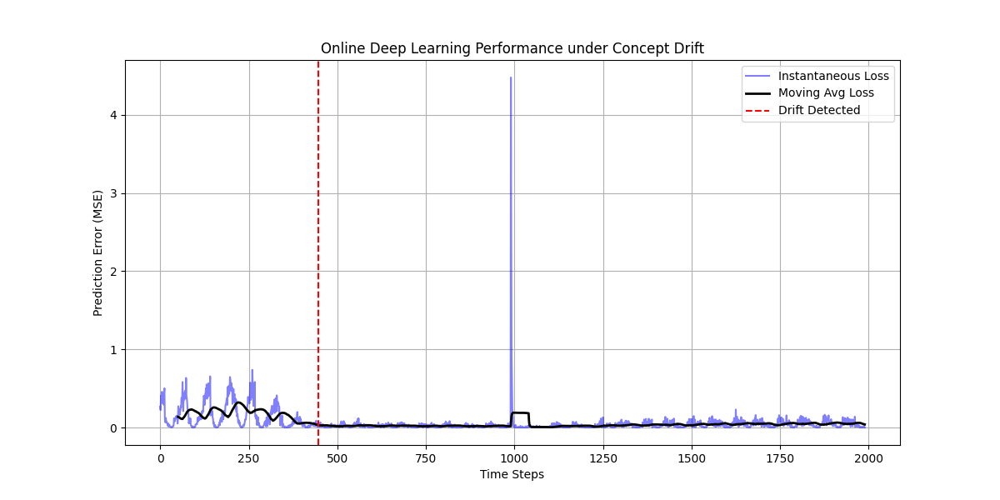

# Online Deep Learning for Industrial Time-Series Prediction under Concept Drift

## 📌 Project Overview
This research proposes a **Fuzzy-Adaptive Online LSTM** to handle Concept Drift in industrial sensor data. Unlike static models, this system learns continuously and adapts its learning rate dynamically using Fuzzy Logic when prediction error spikes.

## 🚀 Key Features
- **Online Learning:** Processes data streams one sample at a time (no batch training).
- **Concept Drift Detection:** Uses ADWIN (Adaptive Windowing) to detect system faults.
- **Fuzzy Adaptation:** dynamically adjusts the optimizer's Learning Rate based on real-time loss.
- **Simulated Environment:** Includes a synthetic industrial data stream generator with programmed drift events.

## 📊 Results
Our experiment demonstrates rapid recovery from sudden concept drift.


* **Step 450:** Early drift warning detected.
* **Step 1000:** Induced Concept Drift (simulated failure).
* **Step 1001+:** The Fuzzy-LSTM adapts immediately, reducing error back to near-zero levels.

## 🛠️ Installation & Usage
1. **Clone the repo:**
   ```bash
   git clone [https://github.com/YOUR_USERNAME/WCCI-26-DL-10.git](https://github.com/YOUR_USERNAME/WCCI-26-DL-10.git)
   cd WCCI-26-DL-10